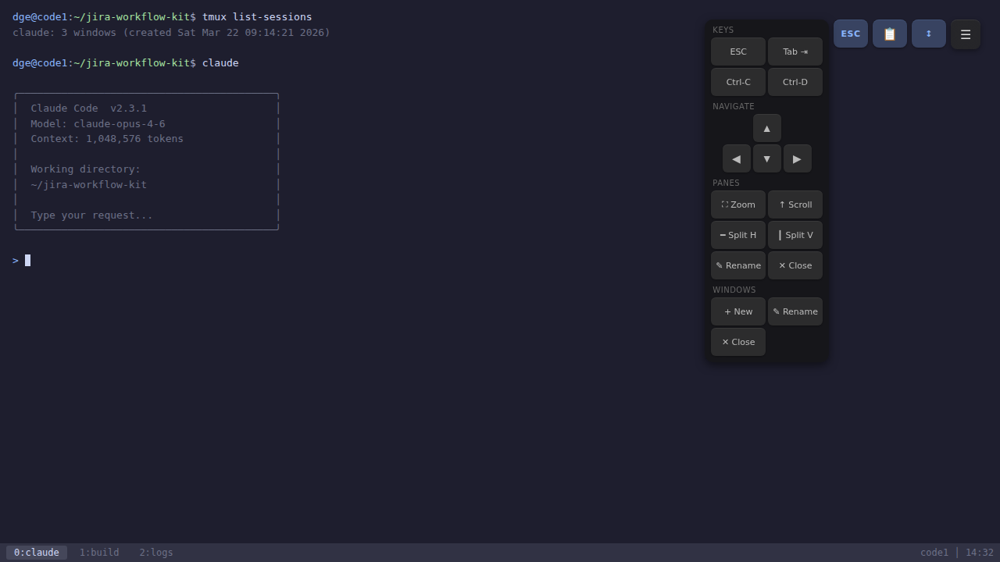
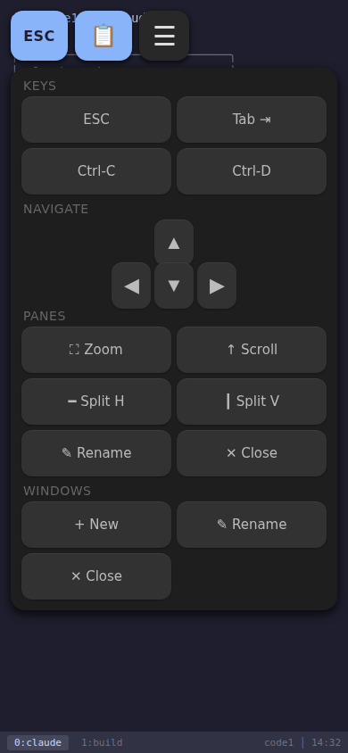

# xterm-mobile

Mobile-friendly tmux overlay for [ttyd](https://github.com/tsl0922/ttyd) — turns a browser terminal into a touch-friendly control panel with pane navigation, scroll support, and iOS optimizations.

| Desktop | Mobile (iPhone) |
|---------|-----------------|
|  |  |

## What it does

Patches ttyd's compiled `index.html` with:

- **tmux control panel** — glassmorphism overlay with pane navigation (D-pad), split/zoom/kill, window management, and special keys (ESC, Tab, Ctrl-C, Ctrl-D)
- **Mobile/iPhone optimizations** — touch-friendly button sizes, zoom prevention, gesture blocking
- **Swipe-to-scroll** — translates touch swipes into SGR mouse wheel events for tmux copy-mode
- **WebSocket intercept** — captures the ttyd WebSocket for sending raw bytes (key sequences, tmux commands)
- **Clipboard paste** — reads from system clipboard and sends to terminal

## Project structure

```
src/
├── overlay.css        # Tmux overlay styling (glassmorphism, Catppuccin colors, responsive)
├── overlay.html       # Control panel markup (toggle, D-pad, action buttons, prompt dialog)
├── overlay.js         # Event handlers, mobile detection, swipe scroll, tmux commands
└── ws-intercept.js    # WebSocket capture (hooks window.WebSocket to grab the ttyd connection)
dist/
└── index.html         # Pre-built: stock ttyd + all customizations (ready to deploy)
build.sh               # Rebuild dist/index.html from source files
```

## Usage

### Deploy the pre-built file

Copy `dist/index.html` to your ttyd config:

```bash
mkdir -p ~/.config/ttyd
cp dist/index.html ~/.config/ttyd/index.html
```

Then start ttyd with the custom index:

```bash
ttyd --writable --port 7681 --interface lo \
  --index ~/.config/ttyd/index.html \
  tmux attach-session -t main
```

### Rebuild after editing source files

```bash
./build.sh
```

### Patch a fresh ttyd build

If you compile ttyd from source and want to apply the overlay to the new `index.html`:

```bash
./build.sh /path/to/fresh-ttyd-index.html
```

## Source files

### `overlay.css`

- Dark glassmorphism theme with `backdrop-filter: blur`
- Catppuccin Latte color palette (`#89b4fa` accent, `#1e1e2e` surfaces)
- Slide-in animation for the control panel
- Responsive: `@media (max-width: 768px)` scales all buttons to 88-96px touch targets
- Fullscreen terminal lock: `position: fixed`, `touch-action: manipulation`

### `overlay.html`

- Hamburger toggle button (☰)
- Quick-access buttons: ESC, Paste (📋), Scroll toggle (⇕)
- Expandable panel with sections: Keys, Navigate (D-pad), Panes, Windows
- Prompt dialog for rename operations

### `overlay.js`

- **Gesture prevention**: blocks pinch-zoom and multi-touch on iOS
- **Mobile detection**: UA sniffing + `matchMedia` + `ontouchstart` check
- **UI scaling**: dynamically resizes buttons for touch (72-96px targets)
- **Terminal fit**: removes scrollbar width, calls `term.fit()` on resize
- **Swipe scroll**: touch movement → SGR mouse wheel escape sequences (`\x1b[<64;40;12M` / `\x1b[<65;40;12M`)
- **tmux commands**: sends `Ctrl-B : <command> Enter` via WebSocket
- **D-pad**: arrow key sequences (`\x1b[A/B/C/D`) for pane navigation

### `ws-intercept.js`

Monkey-patches `window.WebSocket` to capture the ttyd connection in `window.__ttydWS`. Also preloads the JetBrains Mono NF font. Runs once, then restores the original constructor.

## Requirements

- [ttyd](https://github.com/tsl0922/ttyd) (any version with `--index` support)
- tmux
- Python 3 (for `build.sh`)

## License

MIT
